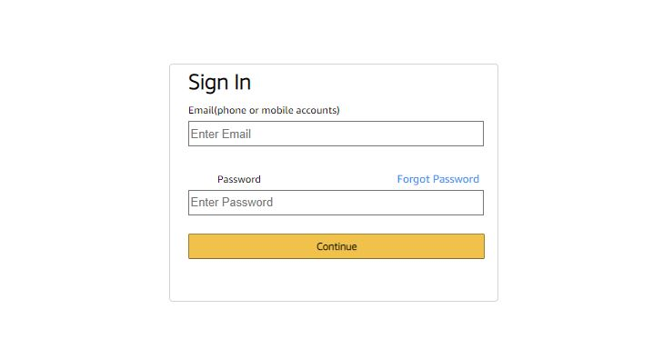

# Amazon Sign-in Replica
> Given a screenshot of a amazon sign-in form, I was to create a replica using
HTML and CSS.

## Table of Contents
* [General Info](#general-information)
* [Links](#links)
* [Technologies Used](#technologies-used)
* [Screenshots](#screenshots)
* [Project Status](#project-status)
* [Room for Improvement](#room-for-improvement)
* [Contact](#contact)

## General Information
The task for this project was to use HTML and CSS only to create an exact replica
of a screenshot of a sign-in form provided.

## Links
- Live Demo URL: [https://marlisarebaum.github.io/amazon-replica/](https://marlisarebaum.github.io/amazon-replica/)

## Technologies Used

## Screenshots

#### Screenshot to be Replicated:

#### My Replica:

## Project Status
Project is:  _complete_ 

## Room for Improvement
Since the task for this project was to just create a replica of a provided screenshot,
the given task was completed successfully.

One area of improvement (while keeping the given tasks in mind):
- For the "Forgot Password" link I used CSS to change the color of the text.
Instead, I could have used an a tag in the HTML to create the same result, 
which would have been a better option, as this would have created a clickable 
link.

## Contact
Created by [Marlisa Rebaum](https://www.linkedin.com/in/marlisarebaum/) - feel free to contact me!